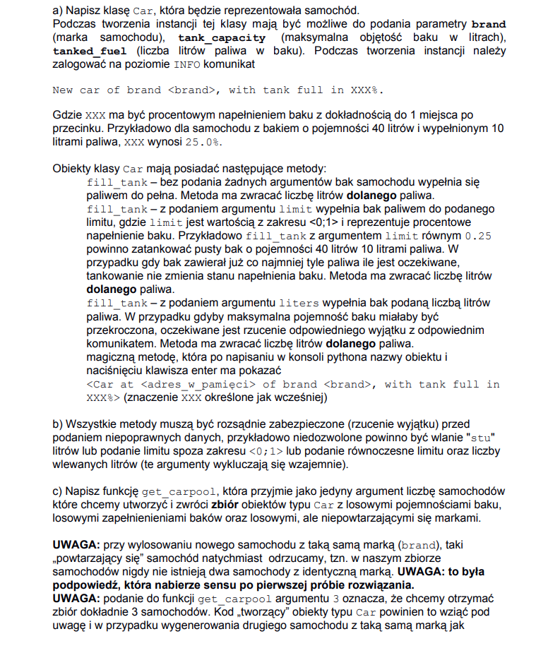
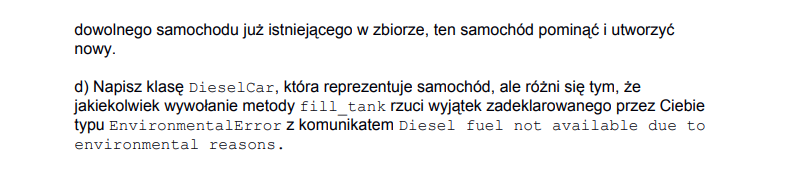

# Car
Program simulating fueling cars

## Table of contents
* [General info](#general-info)
* [Technologies](#technologies)
* [Features](#features)

## General info
Program made as a recruitment task for internship and to practice Python classes and exceptions handling

Task description (unfortunately only in polish):

## Technologies
* Python

## Features
The class `Car` represents a car. When creating an instance of this class, the parameters `brand`,` tank_capacity`,
`tanked_fuel`. When creating an instance, the program logs on the INFO level the message "New car of brand <brand>, with tank full in XXX%.",
Where XXX is to be the tank fill percentage to one decimal place.
The `Car` class objects have the following methods:
- `fill_tank` - without giving any arguments, the car's fuel tank is completely full. The method returns the number of liters of fuel added.
- `fill_tank` - with the argument, the limit fills the tank with fuel up to the specified limit, where the limit is a value in the range <0; 1> and represents the percentage of filling the tank. If the tank already contained at least as much fuel as expected, refueling does not change the filling level of the tank. The method is to return the number of liters of added fuel.
- `fill_tank` - with the argument, liters, fill the tank with the specified number of liters of fuel. In the event that the maximum tank capacity is to be exceeded, an appropriate exception will be thrown with an appropriate message. The method is to return the number of liters of added fuel.
- a magic method that, after writing the name of the object in the python console and pressing the enter key, prints "<Car at <memory_address> of brand <brand>, with tank full in
XXX%> "
All methods are reasonably protected (throwing an exception) against giving incorrect data, for example, it is forbidden to refuel "one hundred" liters or to give a limit beyond the range <0; 1> or to specify both the limit and the number of
liters poured (these arguments are mutually exclusive).

The program has a function `get_carpool`, which takes as the only argument the number of cars we want to create and returns a set of Car objects with random tank capacity, random tank fillings and random but unique brands.

The program also has a class `DieselCar`, which represents a car, but the difference is that any call to the` fill_tank` method throws an exception of the EnvironmentalError type I have declared with the message "Diesel fuel not available due to
environmental reasons. "
